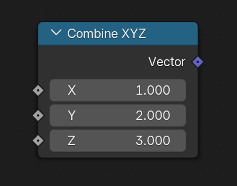
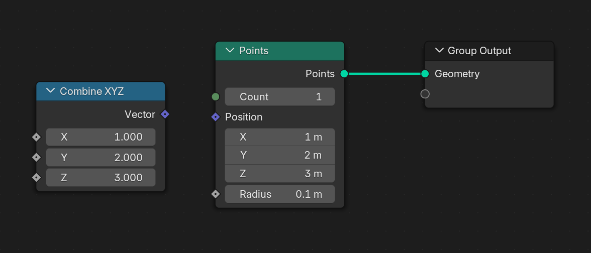

# Vector

## เวกเตอร์ (Vector) คืออะไร?

เราจะเคยเห็น **“ชุดของข้อมูล”** ที่จัดเรียงกันตามลำดับลำดับ เช่น:

- `'หมา', 'แมว' , 'หนู'` → ชุดข้อมูลของสัตว์เลี้ยง  
- `กระเพราหมูสับ, คะน้าหมูกรอบ, ไข่เจียวหมูสับ` → รายชื่ออาหาร  

ถ้าเอาข้อมูลหลายชิ้นมาใส่ไว้ในวงเล็บ `[ ]` หรือ `( )` เราอาจเรียกมันว่า "เวกเตอร์" ได้เหมือนกัน และสามารถนำไปดำเนินการทางคณิตศาสตร์ ได้

#### รายการสั่งซื้ออาหาร

[ กระเพราหมูสับ, คะน้าหมูกรอบ, ไข่เจียวหมูสับ ]  x  [2, 1, 3]

แม่ค้าจะเข้าใจได้ทันทีว่ามีความหมายดังนี้:

* **กระเพราหมูสับ:** 2 ห่อ
* **คะน้าหมูกรอบ:** 1 ห่อ
* **ไข่เจียวหมูสับ:** 3 ห่อ

ให้สังเกตว่า ลำดับ มีความสำคัญ ตำแหน่งที่ 1 ของ set-A เอาไปคูณ ได้ กับตำหน่งที่ 1 ของ set-B เท่านั้น

** เรียกตำแหน่งต่างๆ ตามลำดับ ว่า index

---

## เวกเตอร์ของตัวเลข

ในทางคณิตศาสตร์และกราฟิก 3D  
**เวกเตอร์ = ชุดข้อมูลตัวเลข** ที่บอกขนาด และ ทิศทาง สามารถนำมาดำเนินการทางคณิตศาสตร์ ได้ อย่างมีความหมาย

- **1 มิติ:** `[x]` เช่น `[25]` ขนาด 25 ทิศทาง 25 จาก 0 (จุดเริ่มต้น) 

ตัวอย่างการคำนวณ เวคเตอร์ 1 มิติ

      A ได้เงินมา 20 บาท → เวกเตอร์ A = [20]

      B ใช้เงินไป 10 บาท → เวกเตอร์ B = [-10]

      จงหาเวกเตอร์ C = เงินที่เหลือ

      C = A + B

      C = [20] + [-10]
      
      C = [10]

      สรุป: เวกเตอร์ C คือ [10] → เงินคงเหลือ +10 บาท ทิศทาง เป็น +

- **2 มิติ:** `[x, y]` เช่น `[0, 5]`, `[5.1, 25.5]`  
- **3 มิติ:** `[x, y, z]` เช่น `[0, 1, 3]`, `[12, 25, 91]`

ทุกเวคเตอร์ถ้ายังไม่ได้ทำอะไร (+-*/) ให้เรารู้ไว้เสมอว่าเป็นตัวเลขที่มีระยะห่างจุดกำเนิด ที่ [0, 0, 0]

---

## โลก 3 มิติ

ใน 3D Blender เราใช้เวกเตอร์ 3 มิติ `[x, y, z]` เพื่อระบุตำแหน่งของจุด

- `x` → ระยะในแนวนอน  
- `y` → ระยะในแนวลึก  
- `z` → ระยะในแนวสูง  

> เช่น `[1, 2, 3]` = จุดที่อยู่ห่างจากจุดศูนย์กลางไป X=1, Y=2, Z=3 หน่วย

---

> Z บางโปรแกรมไม่ชี้ขึ้น แต่ชี้มาด้านหน้า ก็ได้ เช่น three.js +Y up

---

## การสร้างเวกเตอร์ใน Geometry Nodes

ใน Blender Geometry Nodes คุณสามารถสร้างเวกเตอร์ได้ด้วย:

**Input > Combine XYZ**

โดยจะใส่ค่าทีละแกน:

- X → ระยะแนวนอน  
- Y → ระยะแนวลึก  
- Z → ระยะแนวตั้ง  

---

## ตัวอย่างเวกเตอร์ง่ายๆ

สร้าง จุด 1 จุด ที่ตำแหน่ง [1, 2, 3]

---

## สรุป

- เวกเตอร์ 3D คือ "ชุดข้อมูล" ตัวเลขที่ใช้บอกตำแหน่ง ทิศทาง และขนาด นับจากจุดอ้างอิง
- ใช้เวกเตอร์ `[x, y, z]` เพื่ออ้างอิงตำแหน่งในระนาบทั้ง 3 
- จุดที่เกิดขึ้น เป็นผลมาจาก ตำแหน่งทั้ง 3 ในแต่ละระนาบ ส่งผลให้เกิดตำแหน่งที่ลอยอยุ่ใน space 3 มิติ

---
